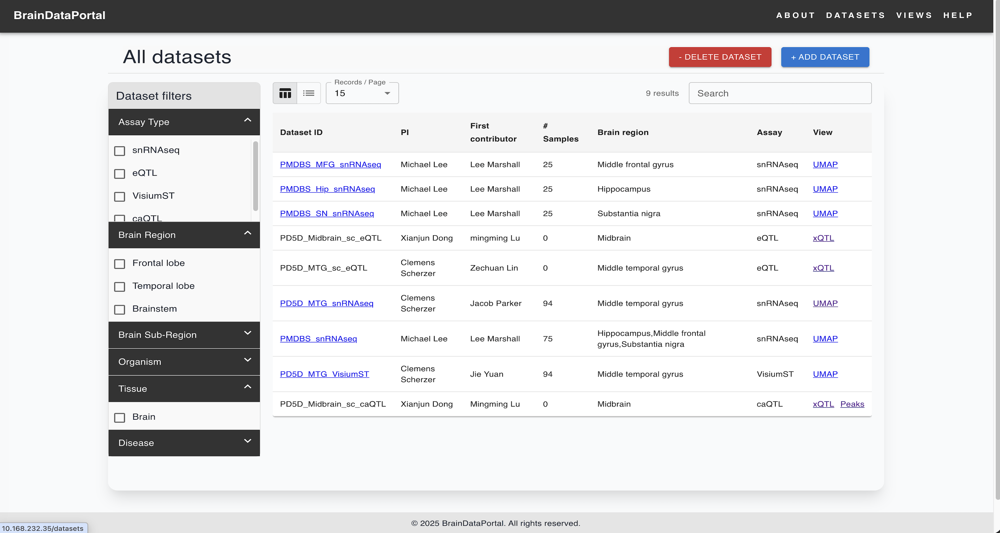
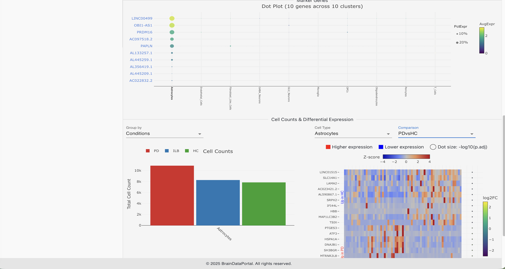
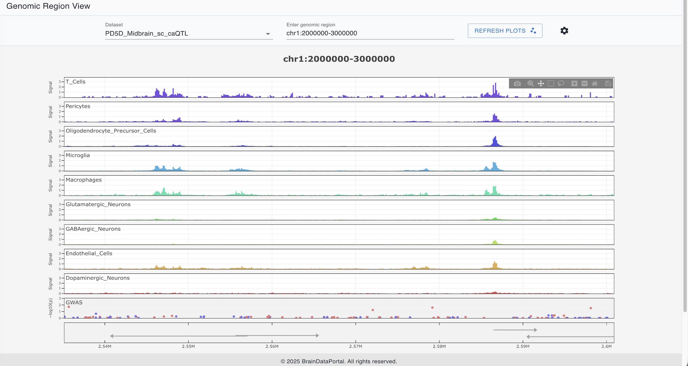

# VizIt

## Installation and running
The Documentation for installation and running the app is available at <a href="https://thedonglab.github.io/VizIt/" target="_blank">VizIt Docs</a>.

### NOTES:
- **VizIt is a general framework for multi-modal data visualization and exploration. You can implement it and customize it for your own data.**
  - Change the home page
  - Rename VizIt to your own App Name
- **At the bottom part you can see we build the BrainDataPortal based on VizIt.**

## Overview
- This is project designed for the brain omics data analysis and visualization.
- The data assays include: scRNAseq, scATACseq, ChIPseq, Spatial Transcriptomics and other omics data.
- The backend is using [FastAPI](https://fastapi.tiangolo.com/) and [uvicorn](https://www.starlette.io/).
- The frontend is using [React](https://react.dev/) and [Vite](https://vitejs.dev/).
- The data is stored in [SQLite3](https://www.sqlite.org/) and JSON files.
- Use zustand for state management, and Material UI for web page layout design

## Directory structure:

    VizIt/
    |-- Backend/
    |   |-- main.py                         ## The main entry of the backend
    |   |-- db.py                           ## The database connection and management
    |   |-- settings.py                     ## The configuration of the backend
    |   |-- requirements.txt                ## The required libraries of the backend
    |   |-- funcs/                          ## This folder contains request handler functions of the backend
    |   |   |-- get_data.py                 ## The request handler functions for data
    |   |   |-- utils.py                    ## The utils functions
    |   |   `-- ...
    |   |-- models/                         ## This folder contains database models of the backend
    |   |   |-- dataset.py                  ## The dataset model/table
    |   |   `-- ...
    |   |-- routes/                         ## This folder contains routes endpoints of requests
    |   |   |-- api_routes.py                
    |   |   |-- qtl_routes.py
    |   |   |-- visium_routes.py
    |   |   `-- ...
    |   |-- SampleSheets/                   ## Upload sample sheets here when adding new datasets
    |   |   |-- Sample_snRNAseq.csv
    |   |   `-- ...
    |   |-- datasets/                       ## The datasets are stored here
    |   |   |-- dataset_1/
    |   |   |   |-- meta_cell.json
    |   |   |   |-- meta_sample.json
    |   |   |   |-- ...
    |   |   `-- ...
    |   |-- bdp_db.db                        ## The database file
    |   `-- ...
    |-- Frontend
    |   |-- index.html                      ## The entry page of the frontend
    |   |-- vite.config.js                  ## The vite configuration file
    |   |-- package.json                    ## The dependencies and dev/build settings of the frontend
    |   |-- env/                            ## The environment variables
    |   |   |-- .env                        ## The global environment variables
    |   |   |-- .env.development            ## The development environment variables
    |   |   `-- .env.production             ## The production environment variables
    |   |-- src/                            ## The source code of the frontend
    |   |   |-- App.jsx                     ## Define the routes of the frontend
    |   |   |-- index.css                   ## The global styles of the frontend
    |   |   |-- main.jsx                   ## The entry file of the frontend
    |   |   |-- components/                 ## The components of the frontend
    |   |   |   `-- ...
    |   |   |-- pages/                      ## The pages of the frontend
    |   |   |   `-- ...
    |   |   |-- utils/                      ## The fucntional utils
    |   |   |   `-- ...
    |   |   |-- store/                      ## The stores for state management
    |   |   |-- api/                        ## The api for data fetching
    |   |   `-- ...
    |   `-- ...
    `-- README.md

## Implement VizIt as BrainDataPortal
#### Video demo: [VizIt Video Demo - BrainDataPortal](https://thedonglab.github.io/VizIt/#video-demo)

#### Home Page

#### Dataset selection

#### Single Cell UMAP clustering & gene expression

#### Cluster analysis

#### Spatial Transcriptomics

#### XQTL analysis & Peak signals

